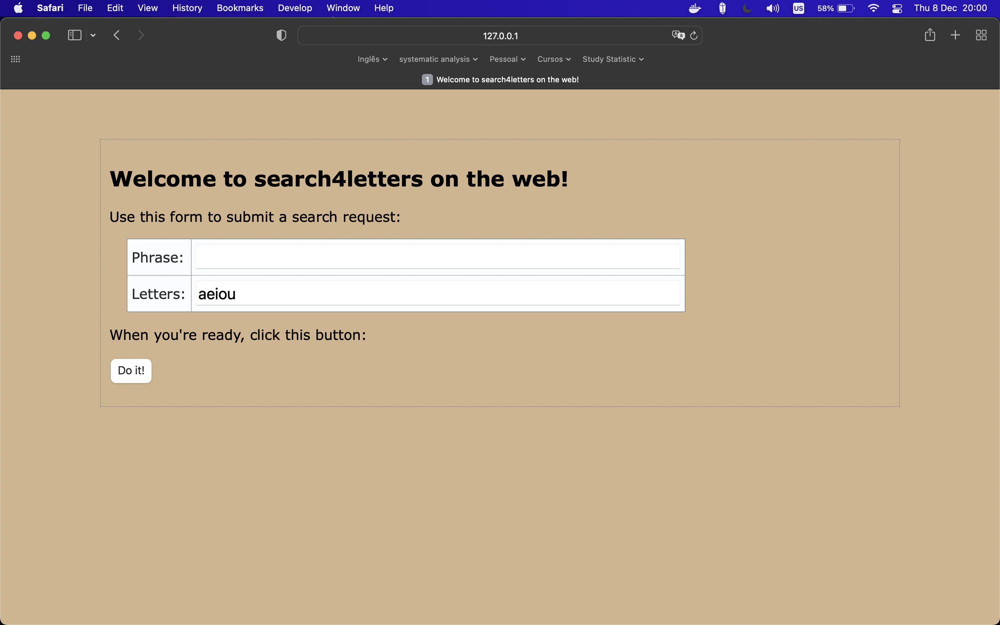
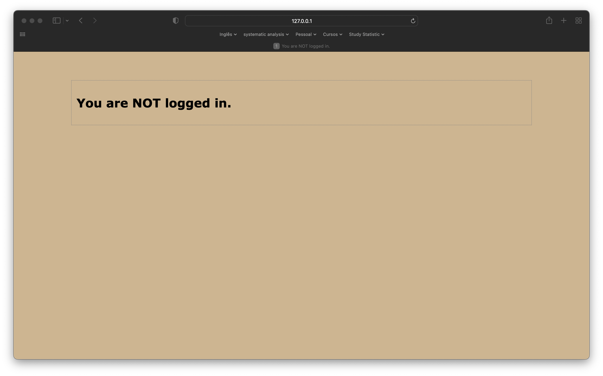
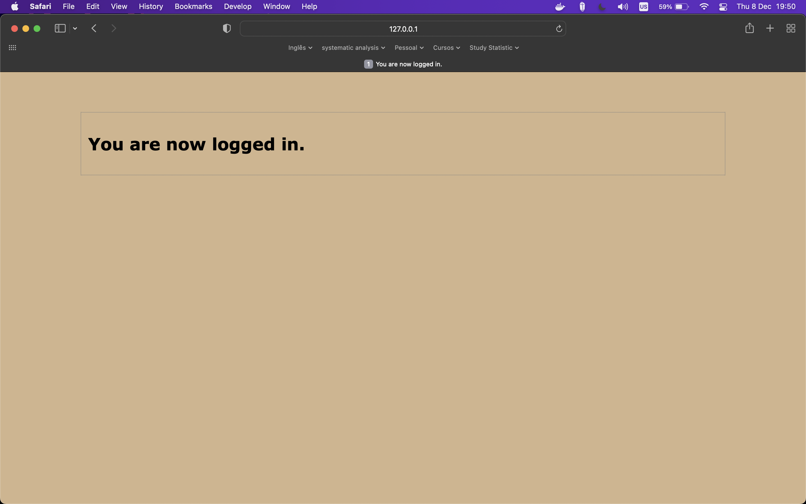
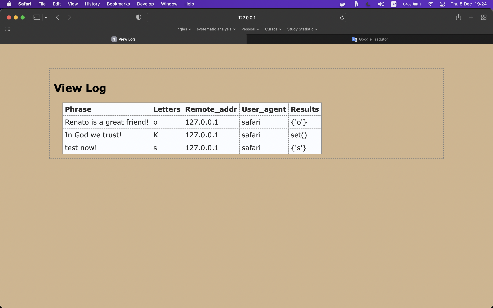

# Vsearch Application

## Description

The objective of the project was to build an application in the Python 3 language, which consists of finding letters in sentences, requested by the user using a web page and storing these queries in a register repository.
For this project, the structuring of the user interface was used, using HTML and CSS.
An algorithm was also developed to carry out the logic of the vsearch program, in addition to creating routes and storing requests made by the requester in a database.
It is important to mention that for this project I`m choose mysql to be the database.

## it was used

* Main python libraries (mysql.connector, flask, jinja2 among others)
* Class
* Decorators
* Docker
* HTML and CSS
* Mysql

## Data model

log table

| COLUMN    | TYPE   | CONSTRAINT  |
| ---   | ---  | ---   |
| id |  int auto_increment   |   PRIMARY KEY |
|ts  |  timestamp |    |
|phrase  |  varchar(128)  |   NOT NULL |
|letters   |  varchar(32)  |     NOT NULL  |
|ip  |  varchar(16) |  NOT NULL     |
|browser_string  |  varchar(256) |  NOT NULL     |
|results  |  varchar(64)  |  NOT NULL     |

## Project Architecture

```bash
.
├── Makefile
├── README.md
├── config
│   └── .env.example
├── docker
│   └── docker-compose.yml
├── help
│   └── sql_query.sql
├── requirements.txt
├── tests
└── webapp
    ├── main.py
    ├── src
    │   ├── DBcm.py
    │   ├── decorator.py
    │   └── vsearch.py
    ├── static
    │   └── hf.css
    └── templates
        ├── base.html
        ├── entry.html
        ├── message.html
        ├── results.html
        └── viewlog.html
```

## Python File

1. weabbp/

* main.py: The `main.py` module is the first to run, with the aim of pulling the whole project together using the necessary modules.

1. src/

* DBcm.py : context manage of database

* decorator.py: decorator using in project to check if session is active

* vsearch.py: the logic of the program

## How to run scripts

First of all, initialize a virtual environment with project dependency, using the script bellow.
Then set the `.env` in config file (if you have some problem, there is `.env.example` for support):

* Variables:
  * **HOST**: ip or url of database
  * **USER**:      database user
  * **PASSWORD**:  database password  
  * **DATABASE**:  database

```bash
make install && source venv/bin/activate
```

Set user and password in docker-compose.yml and run this code

```bash
docker-compose -f docker/docker-compose.yml up -d 
```

See mysql running on docker

```bash
docker ps
```

Enter the container and create the database and table

```bash
docker exec -it 'id_docker' bash
```

authenticate to mysql and after don`t forgot write your password, which you define in config folder, in terminal

```bash
mysql -u root -p 
```

creating database

```bash
create database vsearchlogDB;
```

changing database to vsearchlogDB

```bash
use vsearchlogDB;
```

grant permission for user:

```bash
grant all on vsearchlogDB.* to <user> identified by '<password>'; 

```

creating log table

```bash
create table log(
id int auto_increment primary key,
ts timestamp default current_timestamp,
phrase varchar(128) not null,
letters varchar(32) not null,
ip varchar(16) not null,
browser_string varchar(256) not null,
results varchar(64) not null);
```

Run python script that consist in execute application:

```bash
python3 webapp/main.py
```

## How can we test if the application is working

If the application runs without errors, choose a browser of your choice and access the URL below.
You will see a screen that says "Welcome to search4letters on the web!".
If you don't see these sentences, something is wrong.

* [localhost](http://127.0.0.1:5000/)



perform some tests in the application, typing some phrases, choosing the letters and press button submit.

After, you will see that this page will be blocked until you log in, which is the next step:

* [viewlog](http://127.0.0.1:5000/viewlog)



Then, simulate a login with the url

* [login](http://127.0.0.1:5000/login)



you access this URL to visualize the history of phrases

* [viewlog](http://127.0.0.1:5000/viewlog)


